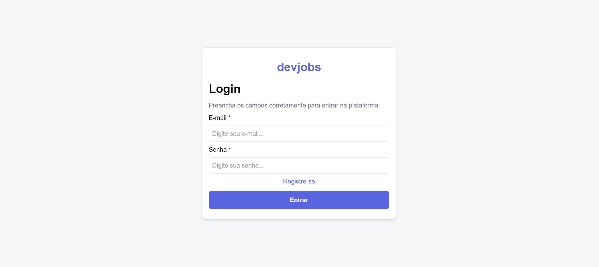
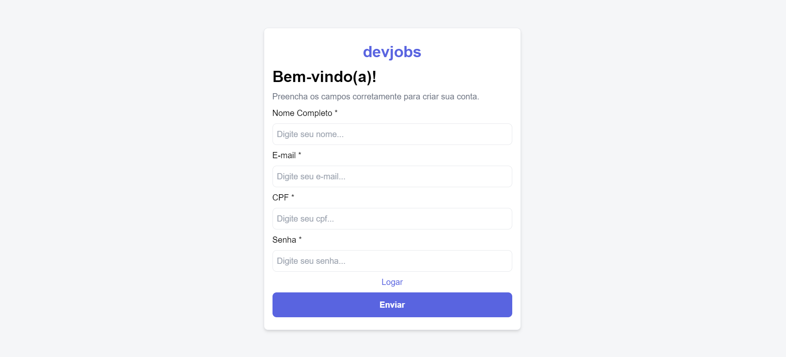
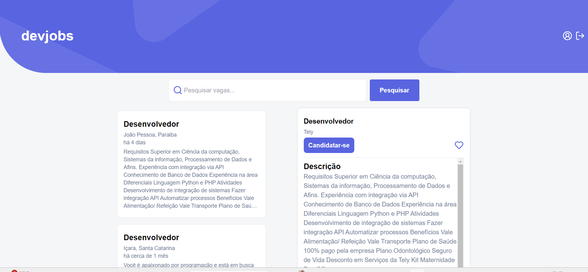
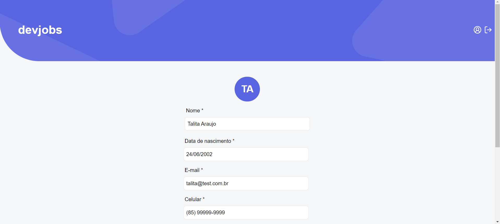

## Devjobs 💜

Aplicação afim de visualizar jobs de Desenvolvores utilizando a API da Adzune

### 📋 Pré-requisitos

- Tenha o Node ou nvm instalado na sua máquina;
- É necessário se registrar para ter as credenciais e acessar a API da Adzune;
- Crie um arquivo .env seguindo a estrutura do .env.example;

## ✨ APIs Externas Utilizadas

- <a href="https://viacep.com.br" target="_blank">CEP</a>
- <a href="https://developer.adzuna.com"  target="_blank">Adzune</a>

### 🔧 Instalação

**Execute:**

```bash
npm i
```

### ⚙️ Executando os testes

**Execute:**

```bash
npm run cypress:run
```

**ou**

```bash
npm run cypress:open
```

### 🚀 Execução

**Execute:**

```bash
npm run dev
```

### 😎 Algumas Fotinhas

#### Login

<p align="center">
    
</p>

#### Register

<p align="center">
    
</p>

#### Home

<p align="center">
    
</p>

#### Vagas Curtidas

<p align="center">
    
</p>

#### Perfil

<p align="center">
    
</p>
